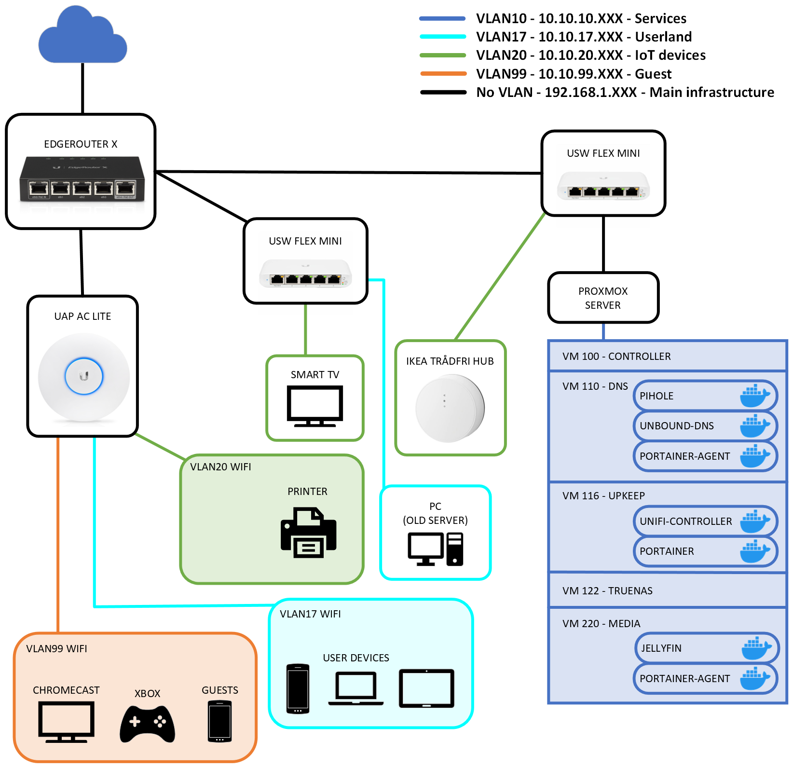

# Homelab

This repository contains my personal notes, scripts, ansible playbooks etc. This material is designed to work in my personal homelad and you probably shouldn't copy paste this to your setup. You are however free to use whatever material you find useful to modify to your own use.

## My homelab

Different services are run in Docker containers inside Proxmox virtual machines. Virtual machines are created using Debian 12 cloudinit images and running ansible playbooks to prepare them. Most services and VMs adhere to ideas of infrastructure-as-code.

Future projects include:
- SWAG container from Linuxserver.io to use as a reverse proxy inside home network.
- Terraform scripts for VM creation.
- Photo gallery to browse photo archive inside home network.

As of september 2023 my homelab layout is something like this:
