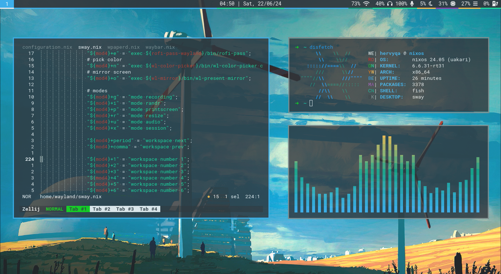
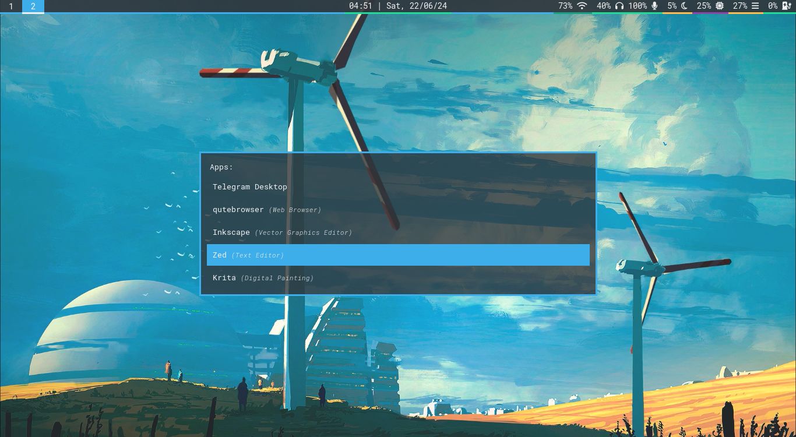
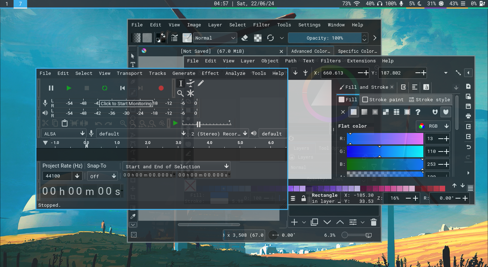
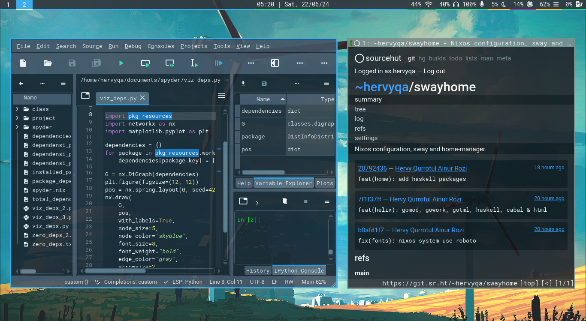

# Swayhome

This is the [NixOS](https://nixos.org/) configuration repository for my machines.
Include [Sway WM](https://swaywm.org) and
[Home Manager](https://nix-community.github.io/home-manager/) configuration.

## 🐬 Gallery




Uniform look for GTK2/3/4 and QT5/6 applications with Dark Mode (Breeze-Dark
theme from [KDE](https://develop.kde.org/hig/style/color/dark)).




## 💠 File structure

- [home](./home) : Home-manager configuration.
  - [config](./home/config) : List of user config directory (~/.config).
  - [dconf](./home/dconf) : List of user dconf settings.
  - [fonts](./home/fonts) : List of user fonts config.
  - [packages](./home/packages) : List of user packages without configuration.
  - [programs](./home/programs) : List of user packages with configuration.
  - [services](./home/services) : List of user services.
  - [theme](./home/theme) : List of user themes.
  - [wayland](./home/wayland) : Window manager configuration (sway).
  - [xdg](./home/xdg) : Manage mimeapps and user-dirs.
- [nixos](./nixos) : System configuration.
  - [hardware](./nixos/hardware) : List of hardware configuration.
  - [programs](./nixos/programs) : List of programs installed through the system.
  - [services](./nixos/services) : List of system services.
  - [system](./nixos/system) : List of system settings.
  - [theme](./nixos/theme) : List of system themes.
  - [virtual](./nixos/virtual) : Isolation environments and virtual machines.
- [asset](./asset) : List of screenshots, wallpapers, video, etc.

## 💎 List of apps

| Category          | Name                  | Alternative  | Description                                             |
| :---------------- | :-------------------- | :----------- | :------------------------------------------------------ |
| Window manager    | `sway`                |              | Tiling wayland compositor.                              |
| Panel Bar         | `waybar`              |              | Customizable wayland bar for sway.                      |
| Terminal          | `foot`                |              | Minimalistic Wayland terminal emulator.                 |
| Audio player      | `ncmpcpp`+`mpd`       |              | Ncurses based mpd client.                               |
| Backlight         | `light`               | `swayosd`    | Application to control backlights.                      |
| Battery daemon    | `batsignal`           |              | Lightweight battery daemon written in C.                |
| Bluetooth         | `rofi`+`bluetoothctl` |              | Interface to connect to bluetooth devices.              |
| Browser           | `qutebrowser`         | `firefox`    | Keyboard-focused browser.                               |
| Display settings  | `wdisplay`            |              | Configuring displays in Wayland compositor.             |
| Dynamic wallpaper | `wpaperd`             |              | Minimal wallpaper daemon for Wayland.                   |
| File manager      | `joshuto`             |              | Ranger-like terminal file manager.                      |
| Fonts             | `fira-sans:10`        |              | Minimalist sans font.                                   |
| GTK2/3/4 theme    | `breeze-dark`         |              | Design language of the kde plasma desktop environment.  |
| QT5/6 theme       | `breeze-dark`         |              | Style to bend Qt applications to look like kde plasma.  |
| Icons             | `papirus-icon-theme`  |              | Pixel perfect icon theme for linux.                     |
| Image viewer      | `imv`                 | `krita`      | Command line image viewer.                              |
| Login manager     | `greetd`              |              | Minimal and flexible login manager daemon (autologin).  |
| Menu              | `rofi`                | `wofi`       | Window switcher, run dialog and dmenu replacement.      |
| Notification      | `mako`                |              | Lightweight wayland notification daemon.                |
| Password store    | `rofi`+`pass`         |              | Stores, retrieves, generates, & synchronizes passwords. |
| Pick color        | `wl-color-picker`     |              | Wayland color picker that also works on wlroots.        |
| PDF viewer        | `zathura`             |              | Highly customizable and functional pdf viewer.          |
| Screen lock       | `swaylock`            |              | Screen locker for wayland.                              |
| Screen recorder   | `wl-screenrec`        | `obs-studio` | Screen recording of wlroots-based.                      |
| Shell             | `fish`                | `bash`       | Smart and user-friendly command line shell.             |
| System monitor    | `bottom`              | `htop`       | Graphical process/system monitor.                       |
| Terminal session  | `zellij`              | `tmux`       | Terminal workspace with batteries included.             |
| Text editor       | `helix`               | `neovim`     | Post-modern modal text editor.                          |
| Video player      | `mpv`                 |              | General-purpose media player.                           |
| Volume control    | `pamixer`             | `pulsemixer` | Command line mixer.                                     |

## 🐳 Sway usage

| Keybinding                    | Next key                          | Description                                                         |
| :---------------------------- | :-------------------------------- | :------------------------------------------------------------------ |
| `Mod`                         |                                   | Meta key with logo (mod4).                                          |
| `Mod` + `Number`              |                                   | Move to workspace (num=1-9).                                        |
| `Mod` + `Enter`               |                                   | Terminal (foot).                                                    |
| `Mod` + `h` / `j` / `k` / `l` |                                   | Focus to window.                                                    |
| `Mod` + `d`                   |                                   | Application launcher (rofi).                                        |
| `Mod` + `y`                   |                                   | Bluetooth launcher (rofi).                                          |
| `Mod` + `c`                   |                                   | Clipboard manager (rofi).                                           |
| `Mod` + `e`                   |                                   | Password store (rofi).                                              |
| `Mod` + `m`                   |                                   | Pick emoji for wayland.                                             |
| `Mod` + `n`                   |                                   | Pick color for wayland.                                             |
| `Mod` + `o`                   |                                   | Simple Wayland output mirror client.                                |
| `Mod` + `f`                   |                                   | Fullscreen window.                                                  |
| `Mod` + `u`                   | `i` / `o`                         | Set sink (input) and source (output) audio.                         |
| `Mod` + `p`                   | `1-3` / `4-6` / `7-9`             | Simple configuring monitor screen with wlr-randr.                   |
| `Mod` + `r`                   | `h` / `j` / `k` / `l`             | Resize window apps.                                                 |
| `Mod` + `x`                   | `h` / `p` / `r` / `s` / `l` / `o` | Hibernate, poweroff, reboot, suspend, lockscreen & logout.          |
| `Print`                       | `1` / `2` / `3` / `4`             | Printscreen area, all, area (copy) & all (copy).                    |
| `Shift` + `Print`             | `1` / `2` / `3` / `4` / `0`       | Recording area, all, area (no audio), all (no audio) & stop record. |

## 🫐 Installation

### Cloning repository

#### Read-only:

| Repository | Command                                         |
| :--------- | :---------------------------------------------- |
| Sourcehut  | `git clone https://git.sr.ht/~hervyqa/swayhome` |

#### Read & write (Recommended):

| Repository | Command                                     |
| :--------- | :------------------------------------------ |
| Sourcehut  | `git clone git@git.sr.ht:~hervyqa/swayhome` |

```sh
cd swayhome
```

### Symlink configuration

```sh
sudo mv /etc/nixos/configuration.nix /etc/nixos/configuration.nix.backup
sudo ln -s $PWD/configuration.nix /etc/nixos/
```

### Install home manager

I am using `24.11` unstable version, home-manager is also using the same
version. Make sure the system and home-manager also use the same version.

| Channel          | Command                                                                                                          |
| :--------------- | :--------------------------------------------------------------------------------------------------------------- |
| 24.11 (unstable) | `sudo nix-channel --add https://github.com/nix-community/home-manager/archive/master.tar.gz home-manager`        |
| 24.05            | `sudo nix-channel --add https://github.com/nix-community/home-manager/archive/release-24.05.tar.gz home-manager` |

Then, update channel.

```sh
sudo nix-channel --update
```

If using a different version, please replace `stateVersion` variables from
[nixos](./nixos/system/default.nix) and [home](./home/default.nix).

## 🧢 User variable

Some variables were found in the `.nix` files. You need to replace it with
another name and value. For example:

```nix
...
}: let
  name = "hervyqa";
  fullname = "Hervy Qurrotul Ainur Rozi";
  email = "hervyqa@proton.me";
  timezone = "Asia/Jakarta";
  defaultlocale = "en_US.UTF-8";
  extralocale = "id_ID.UTF-8";
  layout = "us";
  signingkey = "D7B52C04D9B40738";
  hostname = "nixos";
  version = "24.11";
in {
...
```

## 💙 Configure hardware

If you are installing NixOS for the first time, there is a
`hardware-configuration.nix` file, you can change variables and include each
existing module in dotfile settings. You don't need to take all the settings
like these dotfiles, just take the part you need.

### Processor

My machine uses `intel` machine. You can change it if you use another processor
like `amd`.
Nix file: [nixos/hardware/processor.nix](./nixos/hardware/processor.nix).

```nix
hardware = {
  cpu = {
    # amd or intel
    amd = {
      updateMicrocode =
       lib.mkDefault config.hardware.enableRedistributableFirmware;
    };
  };
};
```

### File systems

Change UUID of `/`, `/home` and `/boot` partition.
Nix file: [nixos/hardware/filesystem.nix](./nixos/hardware/filesystem.nix).

```nix
fileSystems = {
  "/" = {
    device = "/dev/disk/by-uuid/56f0a8d0-7c8b-4849-9d18-def00c2a7b47";
    fsType = "ext4";
  };
  "/home" = {
    device = "/dev/disk/by-uuid/7403caac-87c5-46c4-896e-bc74a3ba8b95";
    fsType = "ext4";
  };
  "/boot" = {
    device = "/dev/disk/by-uuid/ABD9-665E";
    fsType = "vfat";
  };
};
```

### Swap partition

If you have a swap linux partition (optional).
Nix file: [nixos/hardware/swapdevices.nix](./nixos/hardware/swapdevices.nix).

```nix
swapDevices = [];
```

## 🗳 How to build

This dotfile is installed with the nixos module.
There is no need to run `home-manager switch`
because the system and user configuration are built together.

```sh
sudo nixos-rebuild switch
```

For next build, i prefer using `doas` as an alternative to `sudo`.

```sh
doas nixos-rebuild switch
```

Or using `dnrs` from fish abbreviation.

Nix file: [home/programs/fish.nix](./home/programs/fish.nix).

```sh
dnrs
```

## 🌊 Check system

```sh
nix-shell -p nix-info --run 'nix-info -m'
```

Sample output.

- system: `"x86_64-linux"`
- host os: `Linux 6.6.35-rt34, NixOS, 24.11 (Vicuna), 24.11pre647193.9f4128e00b0a`
- multi-user?: `yes`
- sandbox: `yes`
- version: `nix-env (Nix) 2.18.4`
- channels(root): `"home-manager, nixos"`
- nixpkgs: `/nix/var/nix/profiles/per-user/root/channels/nixos`

## 📘 License

[MIT License](./LICENSE.md)

Copyright (c) 2024 [Hervy Qurrotul Ainur Rozi](https://hervyqa.id)
